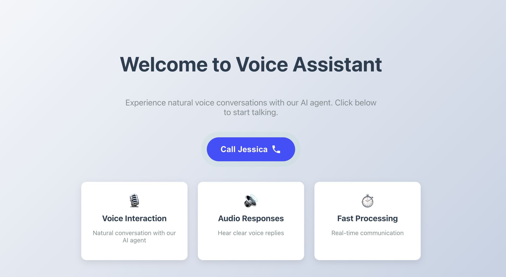
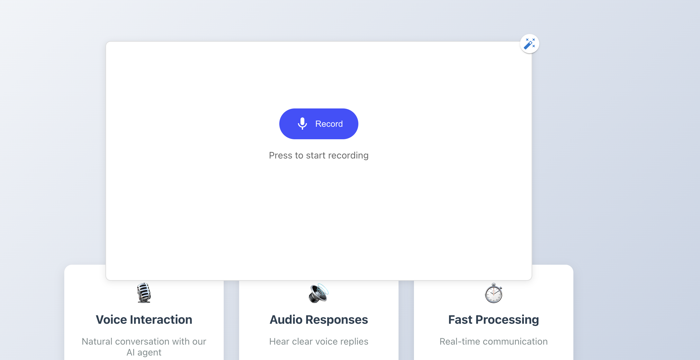
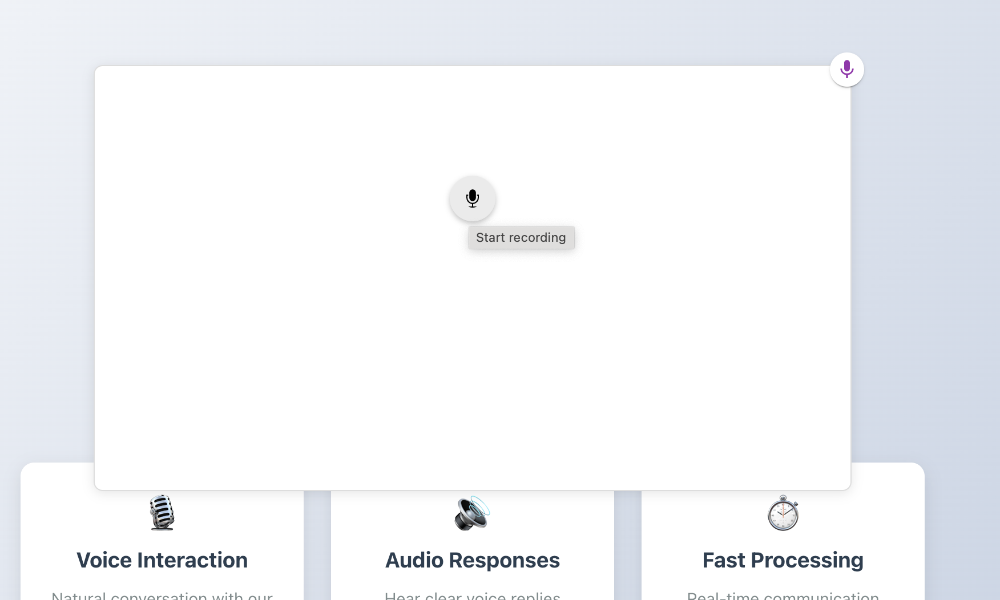

### DEMO # Voice Chat Agent 

# How to run VOICE-CHAT-AGENT locally

Clone the repo:

`git clone https://github.com/kchyzhyk/voice-chat-agent`
`cd voice-chat-agent`
`npm install`
`npm start`

Open in browser:

`http://localhost:3000`

## TechStack 
- Frontend: React 18, TypeScript
- UI: Material-UI (MUI), Emotion
- Audio: react-audio-voice-recorder, Wavesurfer.js
- Networking: WebSocket (react-websocket)
- Build: Create React App (CRA)

## Description
This app allows users to:
- Record voice messages in real-time with noise suppression.
- Visualize audio waveforms using Wavesurfer.js.
- Send audio streams via WebSocket for live communication.
- Built with React + TypeScript for type safety and a clean UI with Material-UI (MUI).

Implemented Features
✅ Audio Recording

Uses react-audio-voice-recorder for high-quality recording with echo cancellation.

Customizable audio constraints (noise suppression, sample rate).

✅ Real-Time Communication

WebSocket integration (react-websocket) for live audio streaming.

✅ Waveform Visualization

Wavesurfer.js renders audio waveforms for recorded clips.

✅ Responsive UI

MUI components for a consistent design

